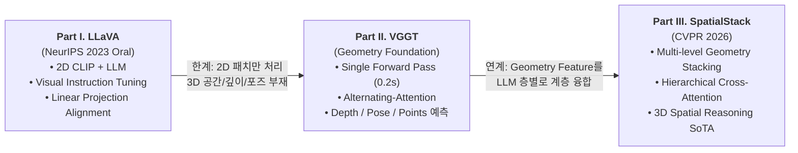

# 🌐 VLM Evolution: From 2D Instruction Tuning to 3D Spatial Reasoning
> **LLaVA → VGGT → SpatialStack**: 2D 비전-언어 정렬부터 3D 기하 파운데이션 모델, 그리고 계층적 3D 공간 추론 VLM으로의 진화 흐름 통합 분석

- **Presenter**: 이준형 (Junhyeong Lee)
- **Presentation Date**: **2026.09.21**
- **Integrated Review Slide**: [📄 LLaVA_VGGT_SpatialStack_Integrated_Review_LeeJunHyeong.pdf](./LLaVA_VGGT_SpatialStack_Integrated_Review_LeeJunHyeong.pdf)
- **Included Papers**:
  1. **LLaVA** (NeurIPS 2023 Oral) — *Visual Instruction Tuning*
  2. **VGGT** — *Visual Geometry Grounded Transformer*
  3. **SpatialStack** (CVPR 2026) — *Layered Geometry-Language Fusion for 3D VLM Spatial Reasoning*

---

## 🧭 Overview & Narrative Flow



---

## 📑 Part I. Visual Instruction Tuning (LLaVA)
> **"단순한 선형 사상(Projection)과 GPT-4 생성 고품질 멀티모달 대화 데이터만으로 강력한 범용 VLM 구축"**

### 1. 핵심 동기 & 아키텍처
- **기존 한계**: 비전-언어 정렬(Alignment) 연구는 많았으나, 인간의 자연어 지시를 따르는 Visual Instruction-following 능력 부재.
- **구조**: 사전학습된 `CLIP ViT-L/14` 비전 인코더와 `Vicuna`(LLM)를 단일 **선형 사상 행렬($W$)**로 직접 연결.
- **데이터 생성 파이프라인**: GPT-4 텍스트 모델에 이미지의 심볼릭 정보(Bounding Box, Caption)를 제공하여 158K개의 고품질 지시-응답 데이터(Conversation, Detailed Description, Complex Reasoning) 생성.

### 2. 2단계 학습 패러다임
1. **Stage 1 (Feature Alignment)**: CC3M 기반 595K 데이터셋으로 **Projection Layer $W$만 학습** (Encoder & LLM Freeze).
2. **Stage 2 (Visual Instruction Tuning)**: 158K 데이터로 **Projection Layer $W$ + LLM 동시 미세조정**.

### 3. 성과 및 한계 (Next Step 연결고리)
- **성과**: ScienceQA 벤치마크에서 **92.53% Accuracy**로 SOTA 달성, GPT-4 대비 85% 수준의 멀티모달 추론 능력 입증.
- **한계점 (Bottleneck)**:
  - 이미지를 단순히 평면 2D 패치 시퀀스로만 처리.
  - 카메라 위치, 깊이(Depth), 3D 기하 구조와 같은 물리적 공간 정보를 전혀 파악할 수 없음.
  - $\rightarrow$ **"실제 물리적 3D 공간을 이해하는 VLM을 위해 무엇이 필요한가?"**라는 질문으로 이어짐.

---

## 📐 Part II. Visual Geometry Grounded Transformer (VGGT)
> **"복잡한 반복 최적화(SfM/BA) 없이 단 한 번의 Forward Pass(0.2초)로 3D 기하 구조를 복원하는 Foundation Model"**

### 1. 기존 3D 추정 방식 vs VGGT 비교
| 구분 | 기존 기법 (DUSt3R, MASt3R, VGGSfM) | **VGGT (Visual Geometry Grounded Transformer)** |
|:---:|:---|:---|
| **처리 방식** | 매칭 $\rightarrow$ 삼각측량 $\rightarrow$ Bundle Adjustment (반복 최적화) | **단일 순전파 (Single Forward Pass)** |
| **추론 속도 (10장 기준)** | ~7초 ~ 10초 소요 | **약 0.2초 (실시간급 고속 처리)** |
| **출력 모달리티** | 특정 기하 속성에 종속 | **Camera Pose, Depth Map, Point Map, Tracking Feature 동시 예측** |

### 2. 핵심 아키텍처: Alternating-Attention
- **Frame-wise Attention (Local)**: 각 이미지 프레임 내부 패치 토큰 간의 공간적 정보 교환.
- **Global Attention (Global)**: 전체 프레임 토큰 간의 대응점 및 시점 일관성 정보 교환.
- **Prediction Heads**:
  - `Camera Head`: 카메라 토큰을 모아 self-attention + linear layer로 Camera Pose 예측.
  - `DPT Head`: Dense feature map으로 변환하여 Depth Map, Point Map 동시 복원.

$\rightarrow$ **SpatialStack은 VGGT를 재학습하지 않고, 이 Alternating-Attention 레이어들의 중간 Hidden States(Geometry Feature)를 VLM의 공간 지각 소스로 재사용함.**

---

## 🧊 Part III. SpatialStack: Layered Geometry-Language Fusion (CVPR 2026)
> **"VGGT의 다계층 기하학적 피처를 LLM 레이어 전반에 점진적으로 주입하여 3D 공간 추론 병목 해소"**

### 1. Why Multi-level Geometry Features?
- **기존 3D VLM의 Late-stage Single Fusion 한계**: 기하 모델의 최상위 심층(Deep) 레이어 피처만 LLM에 융합하면, 얕은 레이어(Shallow)에 존재하는 정밀한 3D 좌표/경계/거리 정보가 소실되는 정보 병목 발생.
- **SpatialStack의 해법**: 
  - **Shallow Features** (국소적 기하/깊이 경계/정밀 좌표) $\rightarrow$ LLM 초기 레이어에 융합.
  - **Deep Features** (광역적 3D 씬 구조/의미론적 공간 관계) $\rightarrow$ LLM 후기 레이어에 융합.

### 2. 점진적 교차 주의집중 스택 (Progressive Cross-Attention Stacking)
- LLM의 트랜스포머 블록 사이사이에 Layered Adapter / Cross-Attention을 배치하여 텍스트 쿼리가 미세 공간 정보부터 고차원 씬 문맥까지 순차적으로 참조하도록 정렬.
- 플러그앤플레이(Plug-and-Play) 방식으로 다양한 LLM 및 Geometry Backbone과 호환 가능.

### 3. 주요 성과 및 결론
- ScanQA, SQA3D 등 3D 공간 질의응답 및 3D Grounding/Bounding Box 예측에서 SOTA 달성.
- 2D 이미지의 단순 캡셔닝을 넘어, **로보틱스(VLA) 및 자율주행, 에이전트 내비게이션**에 필수적인 3D 공간 좌표계 지능 구현의 핵심 패러다임 제시.

---

## 📊 Summary & Key Takeaways

```text
[2D Semantic VLM]                [3D Geometry Foundation]              [3D Spatial Reasoning VLM]
      LLaVA                                VGGT                                SpatialStack
  (NeurIPS 2023)                      (Geometry Backbone)                      (CVPR 2026)
 ─────────────────                  ──────────────────────                  ─────────────────
• 2D Visual Token Align             • Fast Feed-forward 3D                  • Multi-level Geometry Stack
• Linear Projection                 • Alternating-Attention                 • Layered Cross-Attention
• Text-centric Multimodal           • Depth/Pose/Points (0.2s)              • Spatial QA & 3D Grounding
```

- **발표 슬라이드 전문**: [📄 PDF 파일 다운로드 및 열람](./LLaVA_VGGT_SpatialStack_Integrated_Review_LeeJunHyeong.pdf)
- **개별 논문 상세 노트**:
  - [LLaVA 개별 리뷰 노트](../LLaVA/README.md)
  - [SpatialStack 개별 리뷰 노트](../SpatialStack/README.md)
