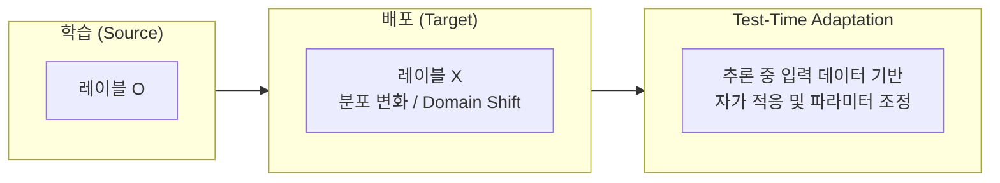

# 🎯 Test-Time Adaptation for 3D Spatial Reasoning VLMs

> **연구 주제 제안서 및 슬라이드 요약 노트**  
> 👤 **발표자 / 연구자**: 이준형 ([@leejunhyeong-02](https://github.com/leejunhyeong-02))  
> 📄 **발표 슬라이드 (PDF)**: [Test-Time_Adaptation_for_3D_Spatial_Reasoning_VLMs.pdf](./Test-Time_Adaptation_for_3D_Spatial_Reasoning_VLMs.pdf)

---

## 📌 1. Research Motivation & Background (연구 출발점)

### ⚾ 이전 연구: KBO 체크스윙 실시간 자동 판정 시스템
* **게재 및 수상**: 한국멀티미디어학회 논문지 (2026, **우수논문상 수상**)
* **핵심 방법론**:
  * `YOLO11n-pose` 기반 2단계 듀얼 모델 (홈플레이트 5 kp + 배트 Knob/Tip 2 kp)
  * 홈플레이트 기울기 기반 원근/시점 보정 한계선 산출 + 2프레임 연속 교차 검증
  * **실시간성**: 프레임당 20.95ms (~47.7 FPS)로 단일 중계 카메라 실시간 판정 달성
  * **성과**: Accuracy 83.45%, Precision 93.42%, Recall 78.89%, F1-Score 85.54%

### ⚠️ 실제 배포 환경에서의 한계 및 문제 인식
1. **Recall < Precision**: 실제 Swing 90건 중 19건을 No Swing으로 판정 (모션 블러 및 타자 몸 가림으로 Tip 위치 축소 추정)
2. **Keypoint Shrinkage**: 60FPS 중계 영상에서 배트 헤드가 블러 처리되어 Tip이 중심 쪽으로 수축되는 현상
3. **환경 다양성 한계**: 단일 시즌(2025) 145건 데이터 기반으로 구장별 카메라 각도, 주/야간 조도, 타자 유형에 따른 Domain Shift 취약

> **핵심 결론**: 학습 환경과 배포 환경이 다르면 성능이 저하되는 **Domain Shift**는 특정 스포츠 판정뿐 아니라 **모든 실세계 비전/멀티모달 모델의 공통 과제**입니다.

---

## 🌐 2. Problem Generalization: Test-Time Adaptation (TTA)

배포 환경마다 라벨을 새로 구축하여 재학습(Fine-tuning)하는 것은 현실적으로 불가능합니다.  
따라서 **라벨 없이, 추론 시점(Test-time)에 들어오는 입력 데이터만으로 모델을 스스로 적응시키는 Test-Time Adaptation(TTA)**이 필수적입니다.

### 🔍 기존 TTA 연구 흐름
* **단일 모달 비전**:
  * `TENT` (ICLR 2021): Batch Normalization 통계 및 Entropy 최소화 기반 적응
  * `CoTTA` (CVPR 2022): 지속적(Continual) 도메인 적응 및 파라미터 드리프트 방지
* **Vision-Language (2D)**:
  * `TPT` (NeurIPS 2022): Test-Time Prompt Tuning
  * `TDA` (CVPR 2024): 훈련이 필요 없는 캐시 기반 적응 (CLIP 분류 중심)
* **남겨진 질문 (Research Gap)**:  
  👉 **LLaVA, VGGT, SpatialStack처럼 생성형(Generative)이면서 Geometry Encoder가 결합된 3D 공간추론 VLM에서는 무엇을, 어떻게 적응시켜야 하는가?**

---

## 💡 3. Proposed Research Directions (연구 방향 후보)

3D 공간추론 VLM을 위한 Test-Time Adaptation 기법으로 다음 3가지 핵심 접근법을 제안합니다.

| No | 연구 방향 | 핵심 아이디어 및 매커니즘 | 관련 연결점 |
|:---:|:---|:---|:---|
| **1** | **Geometry Feature 정렬 적응** | Frozen 상태의 Geometry Encoder(VGGT 등) 히든 스테이트가 새로운 환경에서 분포가 변할 때, 전체가 아닌 **Merger(투영기)의 정규화/경량 파라미터만 Test-time에 갱신**하여 LLM 입력 분포 일관성 유지 | BN 통계 적응의 확장 |
| **2** | **입력 적응형 레이어 선택** | SpatialStack의 고정 레이어 주입(예: L11/17/23) 구조 한계를 극복하기 위해, **질문 유형 및 장면 특성에 따라 각 Geometry 층의 반영 가중치를 Test-time에 동적 조절** | SpatialStack 리뷰의 '입력별 적응 메커니즘 부재' 한계 극복 |
| **3** | **멀티뷰 기하 일관성 기반 자기지도학습** | 같은 장면의 다중 시점(Multi-view)에서 예측된 카메라 포즈 및 3D Point map 간 **기하학적 일관성(Geometric Consistency) 제약을 라벨 없는 자가지도 손실(Self-supervised Loss)**로 활용 | 프레임 연속성 검증의 멀티뷰 3D 일반화 |

---

## 🔬 4. Verification Plan & Expected Challenges

### 📊 검증 계획 (Evaluation Plan)
* **Out-of-Distribution (OOD) 평가**: 학습에 사용되지 않은 신규 실내/실외 3D 장면 및 센서 설정 구성
* **공간추론 벤치마크**: `VSI-Bench`, `ScanQA` 등 표준 3D VLM 벤치마크에서 기존 SOTA 대비 적응 전/후 성능 비교

### ✨ 기대 효과 (Expected Impact)
* 환경별 추가 재학습(Retraining) 없이 범용 3D VLM 즉시 배포 가능
* 고정된 아키텍처 설계를 입력 적응형(Input-adaptive) 구조로 발전

### ⚡ 예상 도전 과제 (Challenges & Solutions)
1. **생성형 출력의 손실 함수 정의**: 단순 Entropy 최소화 적용의 어려움 → 기하학적 일관성 및 Confidence 필터링 활용
2. **오차 누적(Error Accumulation)**: 잘못된 자기지도 신호 누적 방지 메커니즘 구축
3. **추론 속도/메모리 오버헤드**: 거대 LLM/VLM의 Test-time 갱신 비용 최소화를 위한 경량 Adapter 중심 업데이트 설계

---

## 📚 관련 논문 및 자료
* **통합 세미나 노트**: [VLM Evolution: LLaVA → VGGT → SpatialStack](../Integrated-Review/README.md)
* **SpatialStack 상세 리뷰**: [SpatialStack Review](../SpatialStack/README.md)
* **발표 슬라이드**: [Test-Time_Adaptation_for_3D_Spatial_Reasoning_VLMs.pdf](./Test-Time_Adaptation_for_3D_Spatial_Reasoning_VLMs.pdf)
